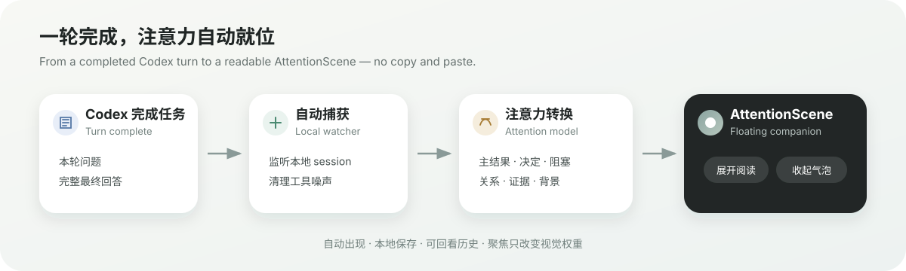
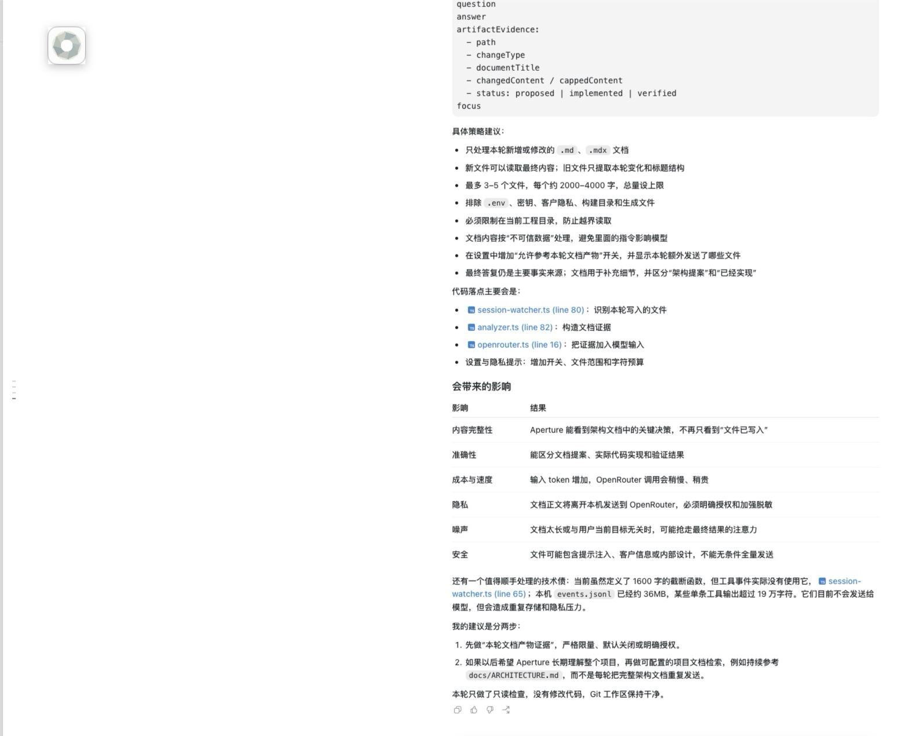
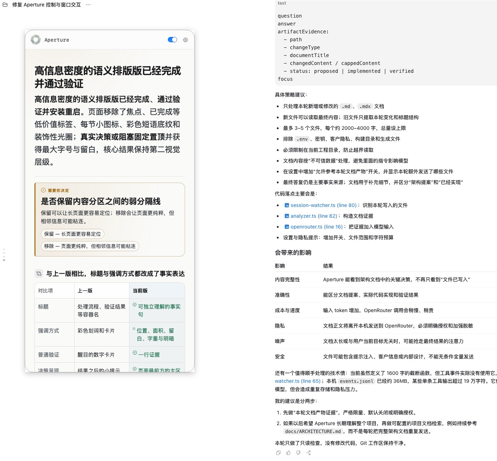
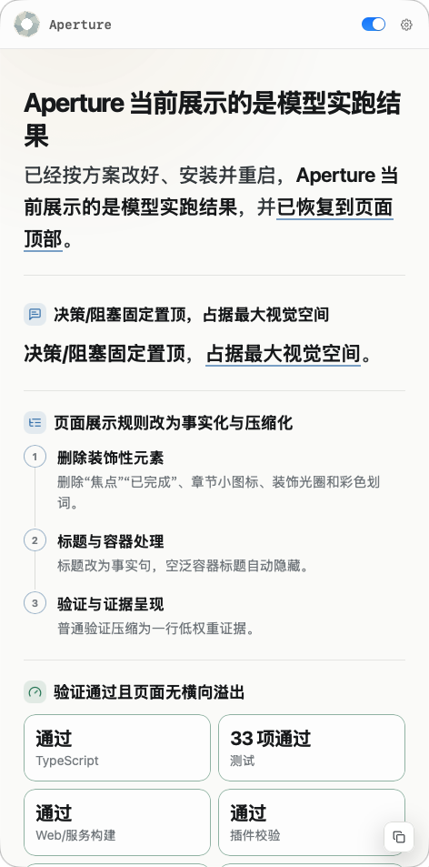
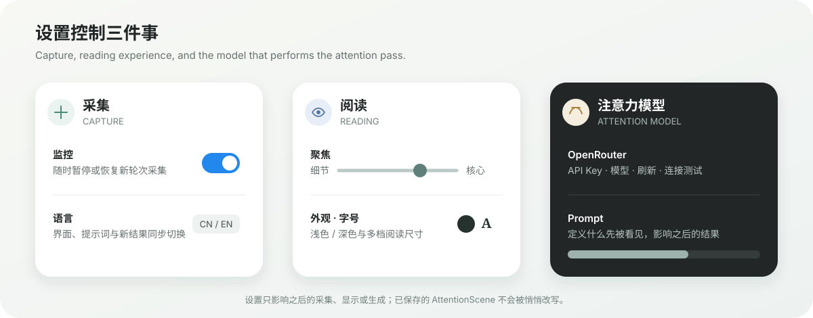

<p align="center">
  
</p>

<h1 align="center">Aperture</h1>

<p align="center">人类输入带宽与大模型输出带宽之间的注意力中间层。</p>

<p align="center"><strong>CN</strong> · <a href="README.en.md">EN</a></p>

Aperture 是位于人类输入带宽与大模型输出带宽之间的 macOS 注意力中间层。Codex 完成一轮工作后，它把完整最终回答重新映射为适合人快速接收的 `AttentionScene`：主结果、真实决定、阻塞，以及必要的关系和背景。

**它不是摘要器。** 摘要追求缩短原文；Aperture 关心的是，在人的当前带宽里，什么应当先被看见、什么必须保留、什么可以退到背景。

注意力转换独立于 Codex 使用的模型。你可以通过 OpenRouter 选择来自不同模型供应商的模型，包括更便宜、更快的模型；也可以随时打开或关闭监控。

## 产品一览

<p align="center">
  
</p>

Aperture 在后台监听本地 Codex 任务。每轮完成后，它自动取出本轮问题与完整最终回答，通过独立的注意力模型生成结构化 `AttentionScene`，再把最值得先看的内容送到悬浮伴侣中。整个过程不需要复制、粘贴或手动触发。

### 收起与展开：需要时出现，不需要时退到边缘

<table>
  <tr>
    <td width="50%" align="center"><strong>收起 · Collapsed</strong></td>
    <td width="50%" align="center"><strong>展开 · Expanded</strong></td>
  </tr>
  <tr>
    <td></td>
    <td></td>
  </tr>
  <tr>
    <td valign="top">阅读完成后收起为无外框的透明金色像素猫咪图标；收到新结果时，猫咪会举起聚焦镜轻轻聚焦并眨眼一次。</td>
    <td valign="top">点击气泡即可恢复悬浮窗口，在当前工作旁边直接阅读，不切换到第二个工作台。</td>
  </tr>
</table>

### 自动化注意力总结：不是截断原文，而是重排阅读顺序

<p align="center">
  
</p>

界面从上到下对应人的阅读优先级：

| UI 组件 | 它回答的问题 |
| --- | --- |
| **主结果** | 这轮真正完成了什么？最大字号与留白让结论先被看见。 |
| **决定 / 阻塞** | 是否存在需要用户选择的分叉，或导致结果不可用的问题？仅在真实存在时固定置顶。 |
| **关系视图** | 信息之间是步骤、因果、对比还是指标关系？Aperture 选择对应的 `flow`、`comparison` 或 `metrics`。 |
| **验证与证据** | 哪些测试、构建或事实支持主结果？普通验证被压缩为高权重证据。 |
| **背景信息** | 哪些内容仍有价值、但不应抢占第一视线？聚焦度越高，模型越主动舍弃低价值背景。 |

新结果会自动出现并按实际完成时间保存在本地；左右方向键可以回看更早或更新的任务。聚焦度直接对应提示词的目标信息压缩率，调整后会重新分析当前结果；真实决定、阻塞、重大风险和行动必需信息始终保留。

### 设置：控制采集、阅读方式与注意力模型

<p align="center">
  
</p>

- **采集**：打开或关闭监控，并切换中文 / English；关闭期间完成的轮次不会在恢复后补处理。
- **阅读**：调整聚焦度、浅色 / 深色外观和字号；聚焦度会重新提炼当前结果，外观与字号只改变呈现。
- **注意力模型**：配置 OpenRouter API Key、模型与自定义 Prompt；连接测试通过后，设置只影响之后生成的注意力场景。

## 快速开始

### 1. 确认环境

当前 `v0.2.2` 预览版需要：

- Apple Silicon Mac（M1/M2/M3/M4 等；暂不支持 Intel Mac）
- macOS 13 Ventura 或更高版本
- [Codex](https://openai.com/codex/)；Aperture 监听 `~/.codex/sessions` 中的本地任务记录
- Node.js 22 或更高版本（推荐当前 LTS）
- OpenRouter API Key 和一个支持结构化输出的模型
- 能访问 OpenRouter API 的网络环境

> Codex 中配置的模型不会自动提供给 Aperture。Aperture 当前独立使用 OpenRouter，需要在应用设置中另行配置 Key 和模型。

检查 Node.js：

```bash
node --version
```

如果尚未安装，可从 [Node.js 官网](https://nodejs.org/en/download) 安装，或使用 Homebrew：

```bash
brew install node
```

### 2. 安装 Aperture

1. 从 [Releases](https://github.com/mujizi/aperture/releases/latest) 下载 `Aperture-v0.2.2-macos-arm64.dmg` 或 `.zip`。
2. 将 `Aperture.app` 拖入 `/Applications`。
3. 首次启动时右键点击 Aperture，选择“打开”。
4. 如果 macOS 仍然拦截，前往“系统设置 → 隐私与安全性”，确认打开。

当前预览包没有 Apple Developer ID 公证，因此首次打开需要手动确认。不要从非本仓库来源下载二次打包版本。

### 3. 配置模型

1. 启动 Aperture：

   ```bash
   open -a Aperture
   ```

2. 点击菜单栏中的 Aperture 图标，打开设置。
3. 通过 OpenRouter 选择来自不同模型供应商的模型，并填写 API Key。
4. 点击连接测试；测试成功后打开“监控”。

Key 只会用于 OpenRouter 请求，并以 `0600` 权限保存在 `~/.aperture/.env`。本地服务只监听 `127.0.0.1:4317`。

### 4. 正常使用 Codex

照常在 Codex 中提问和执行任务。每轮完成后：

- Aperture 自动进入处理状态并显示本轮注意力场景；
- 左右方向键浏览更早或更新的结果；
- 调整聚焦度，以目标压缩百分比重新提炼当前结果；
- 收起为可拖动的透明金色像素猫咪图标，点击图标重新展开；
- 选中文字后复制，或直接复制整份派生 Markdown。

如果重启 Mac 后需要继续使用，请重新打开 Aperture，或在“系统设置 → 通用 → 登录项”中添加 Aperture。

## 设置与控制

| 项目 | 作用 |
| --- | --- |
| 监控 | 随时打开或关闭 Codex 完成轮次的采集。关闭期间完成的轮次不会在重新打开后补处理。 |
| 聚焦 | 左侧保留更多细节，右侧提高目标信息压缩率。调整后重新调用注意力模型分析当前结果，但不会压掉真实决定、阻塞、重大风险或行动必需信息。 |
| 语言 | 在 `cn`（中文，默认）与 `en`（English）之间切换。界面文案、模型提示词和新生成的注意力结果使用所选语言；两种语言分别保留各自的自定义 Prompt。 |
| 外观 | 在浅色和深色界面之间切换。 |
| 字号 | 从紧凑到最大，调整悬浮窗口中的阅读字号。 |
| 大模型配置 | 通过 OpenRouter 配置 API Key，并选择来自各种模型供应商的模型；可以优先选择廉价、快速的模型，刷新模型列表、测试连接后保存。 |
| Prompt | 自定义 Aperture 选择和组织注意力的方式；最多 4000 字符，只影响之后生成的结果。 |

## Aperture 能帮你做什么

### 把模型输出重新映射到人的带宽

从完整最终回答中选择唯一主结果，再保留真正影响判断的证据、风险和行动。它重建注意力顺序，而不是把原回答的每个章节机械缩短。

### 让决定与阻塞显形

只有存在真实选择分叉时才展示 `decision`，只有结果不可用或任务无法继续时才展示 `blocker`，避免把普通建议伪装成紧急事项。

### 按真实关系组织信息

Aperture 根据内容选择合适的表达方式：

- `statement`：独立结论、风险、原因或行动；
- `flow`：真实的顺序、因果或处理链路；
- `comparison`：共享维度下的方案或前后对比；
- `metrics`：数字本身能够解释结果时的指标。

### 在多个任务之间保留完成历史

注意力场景按实际完成时间保存在本地。连续任务或同时运行的多个任务都可以用左右方向键浏览，不需要回到原会话翻找长回答。

## 它如何工作

```text
Codex session JSONL（本地）
          │
          ▼
Session Watcher
          │
          ├── 清理后的本轮问题
          └── 完整最终回答
                    │
                    ▼
             OpenRouter 模型
                    │
                    ▼
          AttentionScene v2
                    │
          ┌─────────┴─────────┐
          ▼                   ▼
   macOS 悬浮伴侣        Markdown / MCP
```

模型输入只包含清理后的本轮问题、完整最终回答和聚焦度。工具调用、工具输出和 Aperture 内部事件不会发送给注意力模型。事件、设置和历史结果保存在 `~/.aperture`。

详细协议和接口见 [架构说明](docs/ARCHITECTURE.md)。

## 隐私与安全

- 服务只监听本机 loopback 地址，不对局域网开放。
- OpenRouter Key 不会通过读取 API、结果或 MCP 返回。
- Key 保存在 `~/.aperture/.env`，文件权限为 `0600`。
- Codex 原始 session 和 Aperture 历史保留在本地。
- 发送给 OpenRouter 的内容可能包含你本轮问题与 Codex 最终回答；请勿在不允许第三方模型处理的项目中启用监控。
- 工具日志当前不进入模型。这降低了噪声和泄露面，但如果关键失败只出现在工具日志、没有写进最终回答，Aperture 也无法自行发现。

## 当前限制

- 仅支持 OpenRouter，不能复用 Codex 的模型认证。
- 当前发布包仅支持 Apple Silicon。
- 需要系统中可用的 Node.js 22+；Node 尚未内置到 App。
- 当前预览包采用临时签名，尚未 Developer ID 签名和 Apple 公证。
- 内容质量、速度和区域可用性取决于所选 OpenRouter 模型。
- 模型偶尔可能把并列信息误判为流程或生成不必要的对比。
- 监控关闭期间完成的任务不会在重新打开后自动补处理。

## 可选 Codex 插件

macOS 伴侣不依赖插件即可工作，因为 Session Watcher 是主要采集通道。仓库中的 `plugins/aperture-attention` 还提供：

- 可选的 Codex 生命周期 Hooks；
- 读取最新 Aperture 结果的 Skill；
- 本地 MCP 接口配置。

插件属于高级集成，不是快速开始的必需步骤。

## 从源码构建

开发环境需要 Node.js 22+、npm、Python 3，以及包含 `swiftc` 的 Xcode Command Line Tools。

```bash
git clone https://github.com/mujizi/aperture.git
cd aperture
npm install
npm run setup:validator
npm run typecheck
npm test
npm run build
```

构建并安装到本机：

```bash
npm run install:mac
```

生成 GitHub Release 使用的 `.dmg`、`.zip` 和 SHA-256 校验文件：

```bash
npm run package:mac
```

产物位于 `.build/release/`。

## 未来方向

未来，人与 AI 的聊天记录可能会成为用户最宝贵的个人数字资产之一。它记录的不只是问答内容，还包含用户如何思考、如何选择工具、如何完成工作，以及哪些方法曾经真正有效。

Aperture 希望让这些 AI 使用记录能够被本地化保存、自动化整理和持续演化。它们不应只停留在某一轮对话的快照或一次任务的 trace，还可以逐步沉淀为长期资产：

- 可以反复使用和继续迭代的 `skill`；
- 围绕项目或领域积累的知识包；
- 属于用户自己的偏好、判断方式和工作习惯；
- 经过验证、有价值、可以再次调用的模型使用经验。

未来的 Aperture 不只帮助用户看清“这一轮发生了什么”，也希望帮助用户拥有、组织并复用自己与 AI 共同创造的经验。这是产品的发展方向，不代表当前 `v0.2.2` 预览版已经实现上述全部能力。

## 设计哲学

### 1. 人的注意力才是最终带宽

模型可以生成越来越长的答案，但用户不应该为每一轮工作重新解析完整输出。Aperture 的目标不是生成更多内容，而是决定什么值得现在占用注意力。

### 2. 它是外围伴侣，不是第二个工作台

Aperture 自动出现、零点击阅读、自然滚动，并可以收起为气泡。它不要求用户学习新的导航系统，也不尝试替代 Codex。

### 3. 先忠于语义，再选择视觉形式

流程只表达真实流程，对比只表达共享维度，指标只在数字能够解释结果时出现。开放、不可预测的 Agent 输出仍以文字为主，图形只负责揭示关系。

### 4. 失败必须可见

模型未配置、超时、失败或返回无效内容时，Aperture 显示明确错误，不用规则压缩或原文回退伪装成功。

### 5. 聚焦控制提示词压缩强度

聚焦度直接映射为目标信息压缩百分比，并在调整后重新分析当前结果。模型优先删除低价值背景、实现细节和重复证据；真实决定、阻塞、重大风险与行动必需信息不受压缩率限制。

### 6. Local-first，但不假装完全离线

采集、存储、历史和展示都在本地；注意力转换当前明确依赖 OpenRouter。系统应清楚展示这条边界，让用户知道哪些数据会离开电脑。

## 工程目录

```text
src/core/                         事件与 AttentionScene 数据协议
src/server/                       Session Watcher、存储、模型、MCP 和 HTTP API
src/web/                          连续注意力场景、关系视图与历史浏览
native/ApertureCompanion/         macOS 悬浮窗、气泡与菜单栏应用
plugins/aperture-attention/       可选 Hooks、Skill、MCP 与运行时
scripts/                          构建、安装与发布打包脚本
```

当前实现状态和已知设计问题见 [CURRENT_STATE.md](docs/CURRENT_STATE.md)。
