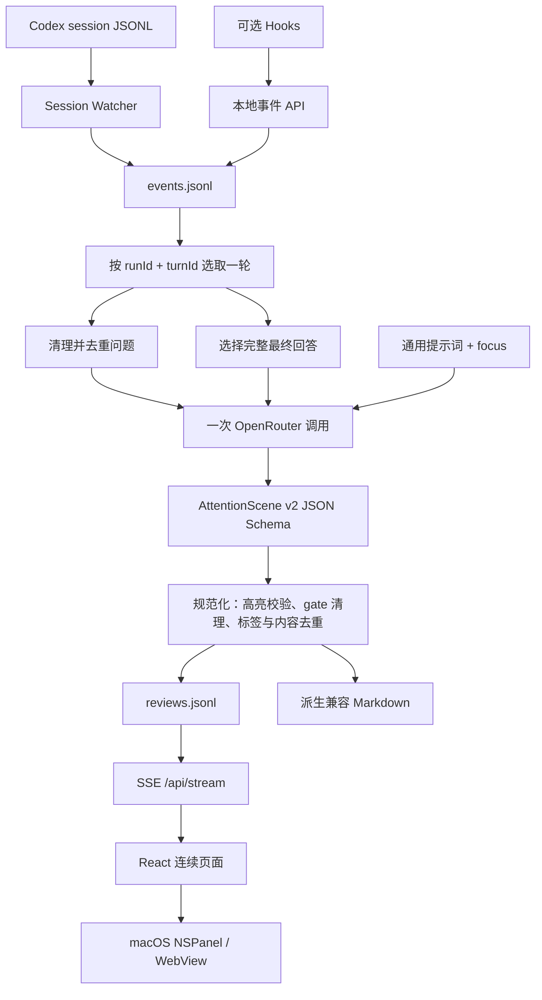

# Aperture 当前状态、架构与 UI/UX 研究记录

> 状态快照：2026-08-01（Asia/Shanghai）  
> 用途：记录当前真正生效的实现、实际界面效果、数据与模型链路、已回退实验、UI/UX 调研结论以及下一轮设计约束。

## 1. 结论先行

Aperture 当前是一层运行在 coding agent 与用户之间的本地注意力整理层。它在一轮任务完成后，读取清理后的本轮提问与完整最终回答，通过一次 LLM 调用生成 `AttentionScene v2`，再在 macOS 悬浮窗中直接展示一张可自然滚动的连续简报。

当前视觉以“上一版连续页面”为基线，并完成了一轮低风险的可读性微调：

- 主结果 `spotlight` 位于页面最前方；
- 真实 blocker 位于主结果之前，普通 decision 位于主结果之后；
- statement、flow、comparison、metrics 全部直接显示，不需要点击、展开或切换；
- 编号流程、对比矩阵、指标卡片和小图标保留；正文划词改为中性字重，只有 change、decision、risk 使用克制的语义色细线；普通 `done` 状态不再显示，只有 `partial`、`proposed`、`unverified` 等例外状态保留标签；
- 工程名移入原生顶栏，位于应用标志右侧，并使用 14pt 等宽半粗体作为工程标识；正文不再重复显示工程名；
- 核心结论区域移除装饰性光圈和渐变，内容区保持纯白背景；
- comparison、flow、gate、状态等次级文字的最小字号已经提高，不再用极小字体制造层级差；
- 最新尝试的“语义排版版”已经撤销，不能把它当作当前设计；
- 问题进入上下文、完整最终回答、工具噪声排除、重复内容删除等输入与模型层改进仍然保留。

当前基线仍不是最终设计。它的优点是比回退前的实验更自然、层级更容易识别，且窄窗口下文字可读性已有改善；缺点是例外状态标签、图标和指标卡片仍可能产生噪声，模型也可能把并列信息误判为流程或对比。

## 2. 当前运行状态

| 项目 | 当前值 |
|---|---|
| Git 分支 | `main` |
| 最近稳定提交 | `b6435af feat: refine attention input and companion experience` |
| 工作区 | 有大量未提交修改与新增文件；当前完整功能不等于 `b6435af` |
| 原生应用 | `/Applications/Aperture.app` |
| 本地服务 | `http://127.0.0.1:4317`，健康检查通过 |
| 数据目录 | `~/.aperture` |
| 监控 | 开启 |
| 模型 | OpenRouter `openai/gpt-5.4-mini` |
| 当前聚焦度 | `0.30` |
| 最近验证 | TypeScript、35 项测试、Web/Server/原生应用构建、插件校验、应用健康检查、Computer Use 实际窗口检查通过 |

当前改动没有再次提交。若要建立新的恢复点，应先确认当前视觉效果，再单独提交，不能直接把稳定提交 `b6435af` 视为完整回退点。

## 3. 当前用户可见效果

### 3.1 页面顺序

```text
原生顶栏：光圈标志 + 工程名 + 监控开关 + 设置
  ↓
blocker（仅真实阻塞存在时，优先于结果）
  ↓
spotlight：本轮最重要结果
  ↓
decision（仅真实选择存在时，位于结果后）
  ↓
0–6 个关系视图：statement / flow / comparison / metrics
  ↓
复制按钮
```

页面不要求用户点击关系节点、切换视图或展开卡片。所有被模型选中的信息都在同一页中，唯一必需交互是自然滚动；左右方向键用于浏览历史结果。

### 3.2 当前视觉组件

| 组件 | 当前表现 | 作用 |
|---|---|---|
| Spotlight | 纯白背景上的标题和摘要；仅例外状态显示标签 | 第一眼说明本轮结果，不重复写“焦点”或“已完成” |
| Gate | decision 或 blocker 卡片 | 表示用户介入点；不存在时完全不显示 |
| Statement | 标题、图标、自然语言；仅例外状态显示标签 | 独立结论、原因、风险或行动 |
| Flow | 带编号和连接线的纵向步骤 | 真实顺序、因果或处理链路 |
| Comparison | 三列共享维度矩阵 | 比较两个版本、方案或状态 |
| Metrics | 两列数值卡片 | 展示能证明结果或规模的数字 |
| Highlight | key、verified 使用中性字重；change、decision、risk 使用语义色细线 | 提供编辑式扫读锚点，不把正文切成彩色标签 |
| Focus | 调整 spotlight、supporting、context 的大小与透明度 | 改变视觉反差，不隐藏语义数据 |

### 3.3 伴侣窗口交互

- macOS `NSPanel` 悬浮显示，不占 Dock；可以收起为无外框的透明金色像素猫咪图标。
- Session Watcher 发现新一轮完成后，界面先进入处理动画，结果到达后实时更新。
- 顶栏用独立字体显示当前工程名，开关控制监控；设置中控制模型、密钥、提示词、聚焦度与主题。
- 页面文字可以选择；复制按钮优先复制选区，没有选区时复制派生 Markdown。
- 左方向键查看更早结果，右方向键返回较新结果。
- 结果按实际任务完成时间排序；同一轮重新分析时替换旧结果，避免重复页。

## 4. 源数据与输入过滤

### 4.1 采集来源

主采集路径是 `CodexSessionWatcher`：

1. 监听 `~/.codex/sessions/**/*.jsonl`；
2. 以 `task_started → task_complete` 为一轮边界；
3. 生成 `session_start`、`user_prompt`、`tool_result`、`assistant_stop` 事件；
4. 把事件保存在本地 `events.jsonl`；
5. 对尚未生成 review 的完成轮次触发分析。

Hooks 仍可向 `/api/events` 提供低延迟生命周期信号，但 Session Watcher 是主要、完整的采集通道。

### 4.2 问题如何进入模型

同一轮内所有真实 `user_prompt` 会：

- 移除已知的 `<environment_context>`、`<recommended_plugins>`、浏览器上下文和附件模板包装；
- 清理 “Files mentioned / My request for Codex” 模板前缀；
- 去重后按出现顺序拼接；
- 作为 `question` 进入模型，只帮助模型理解用户当前关注方向。

问题不是事实来源。提示词明确要求：事实只能来自最终回答，不能因为问题中出现某个假设就把它写成已完成结果。

### 4.3 最终回答如何进入模型

分析器选择本轮最后一个非空 `assistant_stop.last_assistant_message` 作为 `answer`，完整发送给模型：

```json
{
  "question": "清理并去重后的本轮问题",
  "answer": "完整最终回答",
  "focus": 30
}
```

当前不再把最终回答机械截断为前 2400 字，也不发送“工具输入前 900 字 / 工具输出前 1200 字”。工具调用、工具输出、分析事件和 Aperture 内部事件根本不会进入注意力模型输入，因此不存在因为工具截断而丢失尾部结论的问题。

需要区分三种限制：

- 自定义提示词最多 4000 字符；
- `AttentionScene` 各字段有 JSON Schema 长度与数量上限，防止界面失控；
- OpenRouter 请求的 `max_completion_tokens` 当前为 2600，限制的是结构化场景输出，不是源最终回答输入。

### 4.4 工具数据目前的地位

Session Watcher 捕获的工具事件会经过敏感信息清理后保存在本地事件库，主要用于诊断、追踪和未来能力；当前模型总结只依赖最终回答对工具结果的归纳，不复述工具过程。Hooks 事件通道是否需要统一执行同一套脱敏，应在后续安全检查中单独确认。

这个选择的好处是输入干净、成本稳定、不会让工具日志抢占注意力。代价是：如果 agent 最终回答漏掉了关键测试失败，而失败只存在于工具输出中，Aperture 当前不会自行纠正。未来若重新引入工具证据，应先做“异常证据抽取”，而不是把原始工具日志重新塞给模型。

## 5. 当前架构



### 5.1 主要模块

| 模块 | 文件 | 职责 |
|---|---|---|
| Session 采集 | `src/server/session-watcher.ts` | 监听 session、识别完成轮次、清理敏感信息、生成事件 |
| 事件转换 | `src/server/events.ts` | Hook 事件映射与问题模板清理 |
| 轮次分析 | `src/server/analyzer.ts` | 选择问题、最终回答、工程信息并调用模型 |
| 模型与 Schema | `src/server/openrouter.ts` | OpenRouter 请求、结构化输出校验与规范化 |
| 默认提示词与 API | `src/server/index.ts` | 配置、分析调度、SSE、HTTP/MCP 接口 |
| 数据模型 | `src/core/types.ts` | AgentEvent、AttentionDocument v1、AttentionScene v2、ReviewSnapshot |
| Markdown 兼容 | `src/core/attention-scene.ts` | 从场景派生可复制 Markdown |
| 当前场景渲染 | `src/web/ApertureScene.tsx` | spotlight、gate、四类关系视图 |
| 页面状态 | `src/web/CompanionApp.tsx` | SSE、历史、复制、等待/处理中/完成状态 |
| 原生外壳 | `native/ApertureCompanion/` | NSPanel、透明猫咪图标、菜单栏、WebView 与原生桥接 |

### 5.2 `AttentionScene v2` 协议

```ts
interface AttentionScene {
  version: 2;
  spotlight: {
    label: string;
    text: string;
    status: "none" | "done" | "partial" | "proposed" | "unverified";
    highlights: TextHighlight[];
  };
  gate: {
    kind: "none" | "decision" | "blocker";
    title: string;
    detail: string;
    options: string[];
  };
  views: Array<StatementView | FlowView | ComparisonView | MetricsView>;
}
```

`attention` 只有 `supporting | context`；spotlight 和真实 gate 天然属于最高层。`status` 描述交付阶段，`tone` 描述 change、risk、verified 等语义。旧 `AttentionDocument v1` 和纯 Markdown 仅用于旧历史兼容。

模型返回后还会执行确定性规范化：

- 高亮短语必须原样存在于文本中，重复高亮删除；spotlight 最多 2 个、每个 statement 最多 1 个、全场景最多 4 个；
- `gate.kind = none` 时清空误填的标题、详情和选项；
- 相同 label 的重复 view 只保留一个；
- statement 如果只是重复 spotlight 或 gate 内容，直接删除。

## 6. 当前提示词策略

当前使用一份跨任务通用提示词，不先调用独立“意图分类器”，也不为编码、问答、设计、研究等任务强制不同输出模板。

提示词的核心目标是：

- 结合问题理解用户此刻关心什么，但不复述问题；
- 从完整最终回答中选择唯一 spotlight；
- 只有真实分叉才生成 decision，只有无法继续或结果不可用才生成 blocker；
- 根据真实关系自由选择 statement、flow、comparison、metrics；
- 不为可视化而可视化，views 通常 1–4 个，宁缺毋滥；
- gate、spotlight 和 views 不重复表达同一信息；
- 聚焦度映射为提示词压缩率，调整后重新分析当前结果；界面完整显示模型最终选中的内容；
- 不添加事实，不把建议写成已实施，不把未验证写成已验证。

### 为什么当前没有单独意图识别调用

单独意图分类的潜在收益是可以进入不同任务提示词，但当前没有足够证据证明收益大于代价：

- 多一次模型调用会增加延迟和费用；
- 任务经常同时包含实现、诊断、解释、决策，单标签容易误分；
- 分类错误会级联到后续提示词；
- `AttentionScene` 生成调用本身已经在做关系与用户关注方向判断。

如果未来加入路由，建议返回低耦合的 JSON 信号，例如 `intentHints`、`urgency`、`needsDecision`、`confidence`，低置信度自动回到通用提示词；不要把整个系统固定成少数互斥任务类别。

## 7. 演进记录与已回退实验

| 阶段 | 主要变化 | 当前状态 |
|---|---|---|
| 原始 Markdown 聚焦 | 截断最终回答，通过 Markdown 粗体突出 | 已淘汰 |
| 清洁输入 | 问题进入上下文，完整最终回答，工具事件不进入模型 | 保留 |
| AttentionDocument v1 | 用 attention / role / status 代替纯 Markdown 猜测 | 仅兼容历史 |
| AttentionScene v2 | spotlight、gate、statement/flow/comparison/metrics | 当前数据协议 |
| 连续页面 | 所有入选信息直接显示，无点击与展开 | 当前交互基线 |
| 语义排版实验 | 去图标、去状态、去彩色高亮、决策置顶放大、无边框表格、验证单行化 | 已回退 |
| 基线微调 | 工程名移入原生顶栏、隐藏普通状态、提高次级文字最小字号 | 当前视觉 |
| 编辑式划词 | 去掉正文彩色底纹、圆角和双重编码，改用中性字重与少量语义细线 | 当前视觉 |

### 7.1 语义排版实验为什么失败

该实验原本试图用位置、面积、留白和字体代替图标、颜色与卡片，但实际原生页面出现了明显退步：

1. 决策区占据首屏过多空间，普通决策压过真正结果；
2. “事实型标题”变成长句，并与正文重复，信息密度反而下降；
3. 三列表格在窄侧栏中被迫使用更小字号；
4. 普通验证降权过度，接近不可读；
5. 删除图标和颜色后，没有建立同样有效的新视觉锚点；
6. 页面整体更长，违背“扫一眼理解”的目标；
7. 模型仍可能误选 flow 或 comparison，视觉改造没有解决结构选择不稳定的问题。

因此当前已完整恢复上一版视觉。这个失败说明：Aperture 不适合一次性替换整套视觉语法，后续必须以当前基线为对照，每次只改变一个变量并用真实多类型结果评估。

## 8. UI/UX 调研记录

### 8.1 参考来源与可迁移原则

这些资料用于提炼原则，不代表照搬其视觉就会在 Aperture 中成立；前述语义排版实验已经证明，外部灵感必须经过窄侧栏真实样例验证。

| 来源 | 研究到的原则 | 对 Aperture 的启示 |
|---|---|---|
| [Linear：A calmer interface for a product in motion](https://linear.app/now/behind-the-latest-design-refresh) | 高密度界面中，元素的视觉权重应与任务价值相称；减少过量图标；分隔结构应弱化而不是消失 | 支持减少无意义装饰，但不能一次删掉所有视觉锚点；应使用可快速 A/B 的小步改动 |
| [Linear：How we redesigned the Linear UI](https://linear.app/now/how-we-redesigned-the-linear-ui) | 通过对齐、层级、密度和低噪声 chrome 改善复杂产品；设计探索要控制范围和风险 | Aperture 应优先调整内容层级，不应同时重写提示词、数据结构和全部视觉组件 |
| [Apple HIG：Layout](https://developer.apple.com/design/human-interface-guidelines/layout) | 重要内容优先放在自然扫描起点；一致对齐帮助快速定位 | 主结果保持在顶部；decision 是否越过主结果必须由严重程度决定 |
| [Apple HIG：Typography](https://developer.apple.com/design/human-interface-guidelines/typography) | 字号、字重、颜色和间距共同建立层级，避免过多字体样式 | 主要层级应由排版组合完成，但不能只靠大字号 |
| [Apple HIG：Color](https://developer.apple.com/design/human-interface-guidelines/color) | 颜色应克制，并且不能成为唯一信息通道 | risk、decision、verified 可以有语义颜色，但必须同时有文字、位置或形态 |
| [Apple HIG：Panels](https://developer.apple.com/design/human-interface-guidelines/panels) | 辅助面板应轻量、不妨碍主任务 | Aperture 是外围伴侣，不应该要求大量操作，也不应变成第二个完整聊天窗口 |
| [Designing Glanceable Peripheral Displays](https://www2.eecs.berkeley.edu/Pubs/TechRpts/2006/EECS-2006-113.pdf) | 信息类型决定视觉编码；有序信息可用位置、大小、透明度，开放且不可预测的信息仍以文字最有效 | Agent 回答属于开放信息，文本必须是主介质；图形只适合真实流程、比较和有限指标 |
| [Understanding Visual Saliency in Mobile User Interfaces](https://arxiv.org/abs/2101.09176) | 受试研究显示布局预期、顶部起始区域和文本对注意力影响显著，单纯颜色或大小未必稳定 | 先优化顺序与结构，再优化颜色；不要把“更大、更彩”直接等同于更重要 |
| [Vercel Geist：Typography](https://vercel.com/geist/typography) | 为标题、正文和次要信息使用稳定尺度 | 应建立少量可预测的文本层级，不为每种语义发明一种样式 |
| [Vercel Geist：Material](https://vercel.com/geist/material) | 提升层级要克制，过多 elevation 会制造噪声 | 卡片只用于确有边界的内容，不能让每条信息都成为悬浮容器 |
| [Vercel Geist：Badge](https://vercel.com/geist/badge) | Badge 适合简短元数据，不应重复正文事实 | 已隐藏普通“已完成”，只为未完成、方案态或未验证等例外状态保留标签 |
| [Raycast：The New Raycast](https://www.raycast.com/blog/the-new-raycast) | 在保持熟悉与专业感的基础上更新视觉，功能性材质应克制 | 原生伴侣应保留 macOS 熟悉感，视觉创新不能牺牲快速理解 |
| [Raycast Notes](https://www.raycast.com/blog/raycast-notes) | 快速、轻量、低摩擦；复杂能力通过熟悉的 Markdown 与快捷键承载 | Aperture 应继续坚持零点击阅读和键盘历史，不增加常驻导航控件 |

### 8.2 调研后的综合判断

1. **文本仍是主介质。** Coding agent 回答主题开放、结构不可预测，不适合映射成一套必须学习的图形语言。
2. **先用顺序建立注意力。** 用户首先看顶部与文本；主结果、真实阻塞、用户决策的排序比颜色变化更稳定。
3. **视觉语法必须匹配信息关系。** 只有真实顺序使用 flow，只有共享维度使用 comparison，只有数字本身有解释力时使用 metrics。
4. **外围工具要低摩擦。** 不点击、自动出现、自然滚动和键盘历史是正确方向。
5. **克制不等于删除。** 图标、颜色、边框和卡片都可能有价值；问题在于是否重复、是否抢注意力、是否匹配语义。
6. **改版必须可对照。** Linear 的实践也强调小步、开关和快速比较；Aperture 下一轮应保留基线，并对单一变量做真实样例对照。

## 9. 当前已知问题

### 模型与内容

- 模型有时把并列改动误判为 flow，或为了“有结构”生成没有必要的 comparison。
- label、spotlight 和 statement 仍可能语义接近；当前确定性去重只能处理明显重复。
- 同一轮问题清洗只覆盖已知模板；出现新的系统包装时需要继续扩展清理规则。
- 工具日志完全不进模型，依赖最终回答诚实、完整地总结验证结果。
- 模型质量、区域可用性和延迟仍依赖 OpenRouter 所选模型。

### UI/UX

- 小图标和例外状态胶囊仍可能形成不必要的视觉噪声；编辑式划词需要继续用真实长回答观察密度。
- 普通测试数量使用大指标卡片时，权重可能高于其决策价值。
- 三列 comparison 已提高最小字号，但较窄窗口中长文本仍会产生较多换行。
- 高聚焦度通过降低 context 透明度实现，可能在浅色主题或低对比屏幕上影响可读性。
- 当前页面会展示模型选中的所有 views；模型选得过多时页面仍然偏长。

### 工程状态

- 当前 AttentionScene、连续页面、排序修复、输入清洗等改动仍处于未提交工作区。
- CSS 中还保留更早 lens/AttentionDocument 等兼容样式，后续可以在稳定提交后单独清理，避免回退困难。
- `README.md`、`README.en.md`、`README.cn.md` 与 `docs/ARCHITECTURE.md` 已包含面向使用者的架构说明，但本文件才是当前实验与回退状态的完整记录。

## 10. 下一轮设计约束

这些是建议，不是当前已实现功能：

1. 先提交当前回退后的基线，确保可以一键恢复。
2. 建立固定真实样例集：简单完成、方案未实施、真实 decision、blocker、版本比较、真实流程、长回答、仅问答。
3. 每轮只改变一个变量；普通 `done` 已隐藏，后续实验不要同时改标题、颜色、卡片和 gate 顺序。
4. 对照至少记录：5 秒内能否说出结果、是否误报决策、是否遗漏阻塞、重复率、首屏高度、总页面高度、窄窗口可读性。
5. decision 默认紧凑；只有阻塞、不可逆风险或必须立即介入时才允许越过 spotlight。
6. metrics 是否卡片化应由“数字是不是问题本身的答案”决定，而不是只看有没有数字。
7. comparison 在窄窗口中需要自适应：短内容三列，长内容改成成对的前后行，不能通过缩小字号硬塞。
8. 视觉层次优先依赖顺序、对齐、间距和有限字号层级；颜色与图标作为辅助，不作为唯一编码。
9. 若继续探索意图路由，先做可观测的轻量信号和通用 fallback，不立即拆成多套固定任务模板。
10. 所有实验都应通过 feature flag 或独立组件保留当前基线，避免再次出现整套替换后只能手工回退。

## 11. 验证与恢复命令

```bash
npm run typecheck
npm test
npm run build
npm run install:mac
curl -fsS http://127.0.0.1:4317/api/health
```

当前原生应用：

```bash
open -a Aperture
```

当前稳定 Git 检查点是 `b6435af`，但它早于大量 AttentionScene 与当前 UI 改动。回退前应先查看 `git status` 和 `git diff`，不要对工作区执行破坏性重置。
